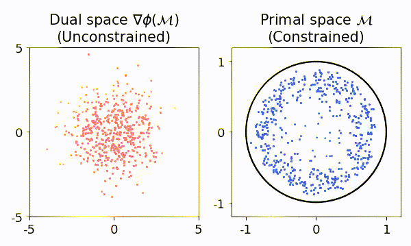
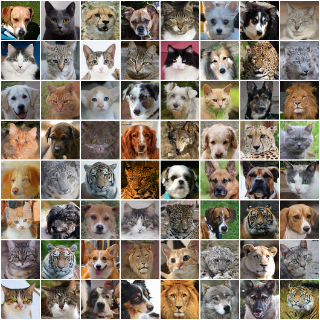
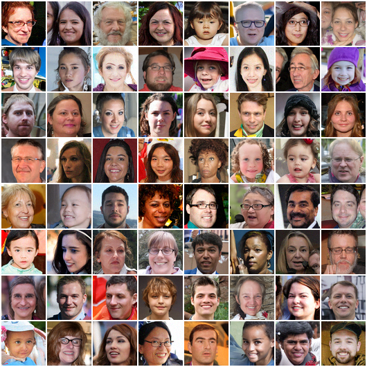

<h1 align='center'>Mirror Diffusion Model (MDM)</h1>
<div align="center">
  <a href="https://ghliu.github.io/" target="_blank">Guan-Horng&nbsp;Liu</a>&ensp;<b>&middot;</b>&ensp;
  <a href="https://tianrongchen.github.io/" target="_blank">Tianrong&nbsp;Chen</a>&ensp;<b>&middot;</b>&ensp;
  <a href="https://sites.gatech.edu/acds/" target="_blank">Evangelos&nbsp;A.&nbsp;Theodorou</a>†&ensp;<b>&middot;</b>&ensp;
  <a href="https://mtao8.math.gatech.edu/" target="_blank">Molei&nbsp;Tao</a>†<br>
  Georgia Institute of Technology&emsp;(†equal advising)
</div>
<h3 align="center">[<a href="https://arxiv.org/abs/2310.01236">NeurIPS 2023</a>]</h3>

Official PyTorch implementation of the paper "[Mirror Diffusion Models for Constrained and Watermarked Generation](https://arxiv.org/abs/2310.01236)" which introduces a new class of dual-space diffusion models for generating samples inside convex constrained sets (_left video_) and watermarked images (_right figures_).

<div align="center">
     
</div>


## Installation
This code is developed with Python3. Install the dependencies with [Anaconda](https://www.anaconda.com/products/individual) and activate the environment `mdm` with
```bash
conda env create --file requirements.yaml python=3
conda activate mdm
```

## Constrained Generation

### Training

To train a mirror diffusion model for constrained generation, run
```bash
python train_constr_gen.py --constraint $CONSTR --xdim $DIM --p0 $P0 --name $NAME
```
where `NAME` is the experiment ID, `DIM` is the problem dimension, and `CONSTR` is the convex constrained set `ball`, `simplex`, and `cube`. Acceptable `P0` for each constrained set can be found in [`scripts/train_constr_gen.sh`](https://github.com/ghliu/mdm/blob/main/scripts/train_constr_gen.sh), which contains the commands to generate similar results shown in our paper. Checkpoints and figures will be saved under the folder `results/$NAME`.

To optionally log the losses and metrics, append `--log-dir $LOG_DIR --log-writer $LOGGER`. We support both tensorboard (`LOGGER=tensorboard`) and W&B (`LOGGER=wandb`). For W&B, append additionally `--wandb-api-key $WANDB_API_KEY --wandb-user $WANDB_USER` after [logining into W&B](https://docs.wandb.ai/quickstart#set-up-wb); here, `WANDB_API_KEY` is the unique API key (about 40 characters) of your account and `WANDB_USER` is your user name.

To resume previous training from the checkpoint, append `--ckpt $CKPT`.

### Evaluation

To evaluate a checkpoint saved under the folder `CKPT_DIR` (_e.g._, `CKPT_DIR=results/gmm`), run
```bash
python eval_constr_gen.py --ckpt-dir $CKPT_DIR
```
By default, we generate `BATCH=512` constrained samples and average the metrics over `N_RUN=3` trials. These options can be changed by `--batch-size $BATCH --n-run $N_RUN`.


## Watermarked Image Generation

We base the image generation framework on [EDM](https://github.com/NVlabs/edm). See the [diff](https://github.com/ghliu/mdm/commit/7d23acb994a66e807f6c27aea9436a69c7dc49fd) for how to (easily!) integrate our watermark mechanism into your own favorate diffusion model backbone.

### Download image dataset & watermark tokens

```bash
bash scripts/download_img_data.sh $DATA
```
where `DATA` can be either `afhqv2` or `ffhq`. This will download _(i)_ [the same dataset zip file as in EDM](https://github.com/NVlabs/edm#preparing-datasets) (with resolution 64), _(ii)_ the pretrained EDM checkpoint for initialization, and _(iii)_ the precomputed orthonomal basis as watermark tokens. All data will be saved under the folder `data`.

See [`notebooks/mdm-proj.ipynb`](https://github.com/ghliu/mdm/blob/main/notebooks/mdm-proj.ipynb) for how to generate your own watermark tokens.


### Training & Sampling (MDM-dual)

After downloading dataset and watermark tokens, we can train a mirror diffusion model in the dual space (**MDM-dual**) by running
```bash
bash scripts/train_img.sh $DATA
```
All results (checkpoints, stats, etc) will be saved under `results`. The sampling command is the same as in [EDM](https://github.com/NVlabs/edm#pre-trained-models). For example, to generate 8 watermarked images from a network snapshot, `NET_PKL=results/...network-snapshot-000000.pkl`, run
```bash
python generate_watermark.py --outdir=out --seeds=0-7 --batch=8 --network $NET_PKL
```

### Sampling from MDM-proj

Alternatively, we can project images generated by a pretrained diffusion model to the watermark token set (**MDM-proj**). This can be done easily with the codes below. Also see [`notebooks/mdm-proj.ipynb`](https://github.com/ghliu/mdm/blob/main/notebooks/mdm-proj.ipynb) for more examples.

```python
from mdm.watermark import ImageWatermark

watermark = ImageWatermark("afhqv2")

image = ... # call pretrained model
watermarked_images = watermark(images)
```

## Citation
```
@inproceedings{liu2023mirror,
  title={Mirror diffusion models for constrained and watermarked generation},
  author={Liu, Guan-Horng and Chen, Tianrong and Theodorou, Evangelos A and Tao, Molei},
  booktitle={Advances in Neural Information Processing Systems},
  year={2023}
}
```
